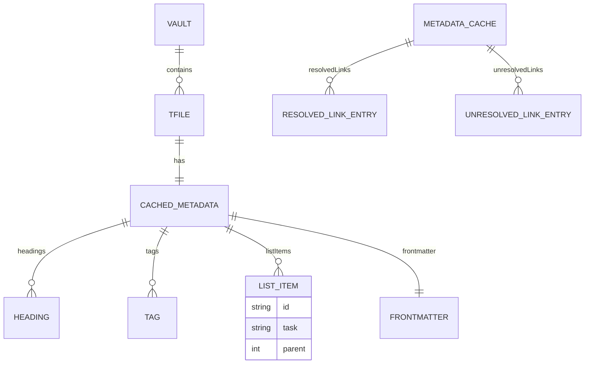

# Investigación profunda sobre Obsidian CLI: funcionamiento y arquitectura para replicar rendimiento

## Resumen ejecutivo

Obsidian CLI es una interfaz de línea de comandos integrada en **Obsidian Desktop 1.12**, diseñada para controlar una instancia **en ejecución** de la app desde terminal (automatización, scripting, y flujos de desarrollo). citeturn1view2turn7search0 La característica se habilita desde la app (Settings → General → “Command line interface”), y la instalación registra un ejecutable en el `PATH` mediante mecanismos específicos por plataforma (PATH en macOS, `.com` redirector en Windows, y symlink en Linux). citeturn8search3turn4view0turn8search2

Para **replicar rendimiento y funcionamiento** “igual de rápido y exacto”, el punto clave es que el CLI oficial **aprovecha el estado vivo de Obsidian**: archivo activo, cachés e índices ya cargados (por ejemplo, el grafo de enlaces resueltos/no-resueltos y el caché de metadatos). citeturn4view0turn21view2turn17view3turn19view0 Una réplica de alto desempeño típicamente necesitará una arquitectura **cliente-servidor local** (CLI del lado terminal + “servidor” dentro de Obsidian, idealmente como plugin) para reutilizar APIs internas como `Vault`, `MetadataCache`, `Workspace` y `FileManager`, que son los módulos principales del modelo de app expuesto para desarrollo de plugins. citeturn15search12turn17view5turn21view2turn19view2

La limitación importante: el **código fuente del Obsidian Desktop** (y por extensión, la implementación del CLI oficial dentro de la app) no se publica como open-source tradicional; por lo tanto, cualquier detalle de IPC interno y handlers privados de Sync/Publish que no estén expuestos por la API pública será **inferido** o requerirá ingeniería inversa / pruebas de caja negra. (En este reporte marco explícitamente qué es verificable vs. especulativo). citeturn7search0turn4view0turn15search12

## Estado de apertura del ecosistema y qué se puede conocer con certeza

### Qué sí es oficial y verificable

* **Existe un Obsidian CLI oficial** desde la línea 1.12 de Obsidian Desktop, anunciado en changelog y documentado en el sitio de ayuda oficial con comandos y opciones. citeturn1view2turn4view0turn7search0  
* El CLI **requiere Obsidian corriendo**; si no está abierto, el primer comando intenta lanzar la app y conectarse. citeturn4view0turn7search0  
* La documentación oficial describe: sintaxis de **parámetros** (`k=v`), **flags** (booleanos sin valor), targeting de vault/archivo, modo TUI (autocompletado e historial), y una **lista de comandos** por categorías. citeturn3view0turn4view0turn3view6turn26view0  
* Hay piezas **open-source** que ayudan a replicar:
  * `obsidianmd/obsidian-api`: definiciones TypeScript del API de Obsidian (módulos como `Vault`, `MetadataCache`, `FileManager`, `Workspace`, etc.) y un resumen de arquitectura de app a nivel plugin. citeturn15search12turn21view2turn17view3turn20view4turn19view0  
  * Obsidian Headless / Headless Sync: cliente CLI **standalone** para servicios (especialmente Sync), publicado como paquete npm y con repo oficial; además documenta módulos nativos y consideraciones de compatibilidad para timestamps. citeturn5view0turn27view0turn6search3  

### Qué es probablemente cerrado o no documentado

* El **IPC interno exacto** del CLI oficial (cómo se conecta del proceso terminal a la instancia de Obsidian, cómo encola comandos, cómo recibe respuestas, multiplexación, etc.) no se describe públicamente; solo se afirma que “se conecta a la instancia corriendo” y que en Windows se usa un redirector para compatibilidad con stdout/stderr. citeturn4view0turn7search0  
* Los comandos de **Sync** y **Publish** interactúan con subsistemas de pago/servicio (Obsidian Sync / Publish); el API pública de plugins no garantiza acceso completo a esas capacidades. Por ello, replicarlos “igual” puede requerir APIs privadas o usar Obsidian Headless como alternativa cuando aplique. citeturn4view0turn27view0  

> Nota de contexto: antes de la salida del CLI oficial, existían CLIs comunitarios (por ejemplo, un proyecto renombrado explícitamente para evitar confusión tras el lanzamiento oficial). Esto importa para que la “réplica” apunte a la especificación correcta (la oficial). citeturn7search5  

## Funcionamiento externo del Obsidian CLI

### Instalación y registro en el sistema

La instalación oficial se realiza habilitando la opción de CLI dentro de Obsidian y siguiendo el registro guiado. citeturn8search3turn4view0 Los detalles por OS son cruciales para una réplica (si buscas comportamiento idéntico):

* **macOS**: el registro agrega el directorio del binario al `PATH` vía `~/.zprofile`; si usas otros shells, debes modificar su config. citeturn4view0turn8search2  
  * Un detalle práctico reportado por usuarios: el ejecutable dentro de la app bundle se llama `Obsidian` (con mayúscula), pero en macOS puede invocarse como `obsidian` por case-insensitive FS/shell typical. citeturn8search2  
* **Windows**: se incluye un **`Obsidian.com` terminal redirector** junto a `Obsidian.exe`, porque una app GUI normalmente no escribe bien a stdout en Windows; el redirector conecta stdin/stdout. citeturn4view0turn8search3  
* **Linux**: el registro crea un symlink (preferentemente `/usr/local/bin/obsidian`, o `~/.local/bin/obsidian` si falla sudo). Para AppImage, el symlink apunta al `.AppImage` por el mount path cambiante. Snap/Flatpak tienen consideraciones extra (p. ej. `XDG_CONFIG_HOME` en Snap para detectar `.asar`). citeturn4view0turn8search3  

### Modos de uso: comando único y TUI interactiva

Obsidian CLI permite:

* **Ejecutar un comando** sin entrar al modo interactivo (ej. `obsidian help`). citeturn7search0turn2view2  
* **Modo TUI** al ejecutar `obsidian` sin subcomando: soporta autocompletado, historial y reverse search (`Ctrl+R`), además de atajos de edición tipo readline. citeturn2view2turn3view6turn4view0  

image_group{"layout":"carousel","aspect_ratio":"16:9","query":["Obsidian CLI TUI screenshot","Obsidian CLI terminal interface autocomplete","Obsidian CLI commands example screenshot","Obsidian 1.12 Obsidian CLI terminal"],"num_per_query":1}

### Sintaxis: parámetros, flags y selección de vault/archivo

**Parámetros**: `param=value` (con comillas si hay espacios). **Flags**: booleanos sin valor (solo presentes o ausentes). Para texto multilínea se usan secuencias como `\n` y `\t`. citeturn3view0turn2view3  

**Selección de vault**:
* Si el *working directory* ya está dentro de un vault, ese vault es el default; si no, el vault activo se usa como default. citeturn2view4turn3view0  
* `vault=<name>` o `vault=<id>` debe ir **antes** del comando (primer parámetro). En TUI existe `vault:open`. citeturn2view4turn3view6  

**Selección de archivo**:
* `file=<name>` resuelve usando la misma lógica de “wikilinks” (link resolution). citeturn2view4turn3view0  
* `path=<path>` exige el path exacto desde la raíz del vault. citeturn2view4turn3view0  
* Si no das `file` ni `path`, muchos comandos operan sobre el **archivo activo**. citeturn2view4turn3view2  

**Flag global de output**:
* `--copy` copia cualquier salida al clipboard. citeturn2view4turn3view0  

## Arquitectura para replicar rendimiento: modelo propuesto y lo que es especulativo

### Observaciones “de caja negra” del CLI oficial

Podemos afirmar (con fuentes oficiales) que:

* El CLI es un **front-end** que controla una instancia viva del escritorio: requiere la app corriendo y “se conecta a la instancia en ejecución”. citeturn4view0turn7search0  
* En Windows existe un componente adicional (redirector) estrictamente para I/O terminal. citeturn4view0turn8search3  
* En Linux y macOS el mecanismo de “instalación” es fundamentalmente **PATH/symlink** hacia el binario de Obsidian. citeturn4view0turn8search3  

### Hipótesis plausible del IPC (marcada como especulativa)

> **Especulativo (no documentado):** La frase “conecta a la instancia corriendo” implica que el CLI no solo lanza la app, sino que intercambia mensajes request/response. Esto típicamente se implementa con uno de estos patrones en apps Electron/desktop:
> 1) **Socket local** (TCP loopback o Unix domain socket) con un protocolo tipo JSON-RPC.  
> 2) **Named pipes**/sockets nativos (muy común en Windows para IPC).  
> 3) **Single-instance forwarding** (segunda instancia pasa argumentos a la primera) + un canal adicional para devolver salida (archivo temporal, pipe, etc.).  

Lo que sí sabemos es que el diseño debe soportar salida estructurada (JSON/TSV/CSV en muchos comandos), y que existe un TUI en terminal que obtiene autocompletado y ayuda contextual (por lo que hay un “catálogo” de comandos/params consultable en vivo). citeturn3view6turn3view3turn26view0turn3view4  

### Arquitectura de réplica recomendada para igualar velocidad

Para igualar rendimiento, el enfoque más realista es:

* **Servidor dentro de Obsidian** (plugin “bridge”) que ejecute operaciones apoyándose en cachés e índices ya construidos por Obsidian: `MetadataCache`, `Vault` (incluyendo `cachedRead`), `Workspace.getActiveFile()`, `FileManager.renameFile`, etc. citeturn15search12turn21view2turn17view3turn19view0turn20view3  
* **Cliente CLI externo** que:
  * Parse comandos (misma gramática `param=value`, flags booleanos). citeturn3view0turn2view3  
  * Mantenga una conexión local persistente (si es posible) para reducir overhead. *(Diseño; no documentado)*  
  * Presente modo “single command” y TUI (autocomplete + history). citeturn2view2turn3view6  

#### Diagrama de componentes (réplica)

```mermaid
flowchart LR
  subgraph Terminal
    U[Usuario] --> C[CLI Client<br/>parser + TUI + formatter]
  end

  subgraph OS["Integración por OS"]
    P1[macOS: PATH a /Applications/Obsidian.app/...]
    P2[Windows: Obsidian.com redirector]
    P3[Linux: symlink /usr/local/bin/obsidian]
  end

  C -->|HTTP/WS/pipe (local)| S[Bridge server dentro de Obsidian<br/>(plugin)]
  C -->|launch si no corre| OS

  S --> A[Obsidian App runtime]
  A --> V[Vault / FileManager<br/>I/O seguro + link updates]
  A --> M[MetadataCache<br/>índices: links/tags/headings/tasks]
  A --> W[Workspace<br/>archivo activo, panes, tabs]
  A --> X[Servicios privados<br/>Sync / Publish<br/>(posible acceso parcial)]

  S -->|respuesta| C
```

*La conectividad exacta (HTTP/WS/pipe) es decisión de diseño de tu réplica; el CLI oficial no publica el transporte.* citeturn4view0turn7search0  

#### Diagrama de secuencia: ejecución de un comando (réplica)

```mermaid
sequenceDiagram
  participant User as Usuario
  participant CLI as CLI Client
  participant Bridge as Obsidian Bridge (plugin)
  participant Ob as Obsidian Runtime
  participant Cache as MetadataCache/Vault

  User->>CLI: obsidian read file=Recipe --copy
  CLI->>CLI: parse params/flags; resolve target vault/file
  CLI->>Bridge: request{cmd:"read", file:"Recipe", copy:true}
  Bridge->>Ob: resolve file via link-resolution API
  Ob->>Cache: Vault.cachedRead(TFile) o Vault.read()
  Cache-->>Ob: contenido/resultado
  Ob-->>Bridge: response payload
  Bridge-->>CLI: stdout payload
  CLI-->>User: imprime salida + copia al clipboard
```

### Modelo de datos mínimo para comandos “rápidos” (cachés)

La API pública describe claramente que `MetadataCache` mantiene:
* `resolvedLinks`: mapa de source→dest con conteos. citeturn21view2turn17view0  
* `unresolvedLinks`: mapa de source→dest no encontrado con conteos. citeturn21view2  
* eventos `changed/resolve/resolved` útiles para invalidación incremental. citeturn21view2  

Además, `CachedMetadata` puede contener `headings`, `tags`, `frontmatter` y `listItems` (donde `ListItemCache.task` codifica el estado del checkbox de una tarea). citeturn23view0turn23view2turn24view2turn25view0  



## Tabla comparativa de comandos y opciones

### Convenciones globales

* **Targeting**: `vault=<name|id>` debe ir primero; `file=<name>` usa resolución estilo wikilink; `path=<path>` es exacto. citeturn2view4turn3view0  
* **Formatos**: múltiples comandos permiten `format=json|tsv|csv|...` según categoría. citeturn3view3turn3view4turn26view0  
* **Flags comunes**: `total`, `verbose`, `open`, `newtab`, `overwrite`, `inline`, etc. (varía por comando). citeturn3view2turn3view3turn26view0  
* **Clipboard**: `--copy` aplica a cualquier comando con salida. citeturn2view4turn3view0  

### Comandos por categoría (tabla resumida, con opciones clave)

> Nota: la siguiente tabla refleja la documentación oficial del CLI. Para una réplica exacta, tu implementación debe igualar defaults (archivo activo, vault activo, formatos, y errores). citeturn4view0turn3view2turn3view4  

| Categoría | Comando | Propósito | Parámetros / flags relevantes |
|---|---|---|---|
| General | `help` | Lista comandos o ayuda de uno | `<command>` (opcional) citeturn3view0 |
|  | `version` | Versión de Obsidian | — citeturn3view0 |
|  | `reload` | Recarga ventana de app | — citeturn3view0 |
|  | `restart` | Reinicia la app | — citeturn3view0 |
| Vault | `vault` | Info del vault | `info=name|path|files|folders|size` citeturn3view5turn2view4 |
|  | `vaults` | Lista vaults conocidos | `total`, `verbose` citeturn3view5turn2view4 |
|  | `vault:open` | Cambiar vault (solo TUI) | `name=<name>` (req) citeturn3view5turn2view4 |
| Archivos | `file` | Info del archivo | `file=<name>`, `path=<path>` citeturn3view2 |
|  | `files` | Lista archivos | `folder=<path>`, `ext=<extension>`, `total` citeturn3view2 |
|  | `folder` | Info de carpeta | `path=<path>` (req), `info=files|folders|size` citeturn3view2 |
|  | `folders` | Lista carpetas | `folder=<path>`, `total` citeturn3view2 |
|  | `open` | Abrir archivo | `file`, `path`, `newtab` citeturn3view2 |
|  | `create` | Crear/sobrescribir archivo | `name`, `path`, `content`, `template`, flags `overwrite`, `open`, `newtab` citeturn3view2turn2view3 |
|  | `read` | Leer contenido | `file`, `path` citeturn3view2turn2view4 |
|  | `append` | Agregar al final | `content` (req), `inline` citeturn3view2 |
|  | `prepend` | Agregar tras frontmatter | `content` (req), `inline` citeturn3view2 |
|  | `move` | Mover/renombrar y (si está activo) actualizar links | `to=<path>` (req) citeturn3view2 |
|  | `rename` | Renombrar (conserva extensión si se omite) | `name=<name>` (req) citeturn3view2 |
|  | `delete` | Borrar | flag `permanent` citeturn3view2 |
| Enlaces | `backlinks` | Backlinks a archivo | `file`, `path`, flags `counts`, `total`, `format=json|tsv|csv` citeturn3view3 |
|  | `links` | Outgoing links del archivo | `file`, `path`, `total` citeturn3view3 |
|  | `unresolved` | Links no resueltos del vault | flags `total`, `counts`, `verbose`, `format=json|tsv|csv` citeturn3view3 |
|  | `orphans` | Archivos sin inbound links | `total` citeturn3view3 |
|  | `deadends` | Archivos sin outbound links | `total` citeturn3view3 |
| Outline | `outline` | Headings del archivo | `format=tree|md|json`, `total` citeturn3view3 |
| Daily | `daily` | Abrir daily note | `paneType=tab|split|window` citeturn3view1 |
|  | `daily:path` | Path esperado (aunque no exista) | — citeturn3view1 |
|  | `daily:read` | Leer daily | — citeturn3view1 |
|  | `daily:append` | Append a daily | `content` (req), `paneType`, flags `inline`, `open` citeturn3view1 |
|  | `daily:prepend` | Prepend a daily | `content` (req), `paneType`, flags `inline`, `open` citeturn3view1 |
| Search | `search` | Buscar texto; devuelve paths | `query` (req), `path`, `limit`, `format=text|json`, flags `case`, `total` citeturn3view4turn26view0 |
|  | `search:context` | Buscar con contexto tipo grep | igual que `search` citeturn3view4turn26view0 |
|  | `search:open` | Abrir vista Search | `query=<text>` citeturn3view4turn26view0 |
| Tags | `tags` | Tags del vault o archivo | `sort=count`, flags `total`, `counts`, `active`, `format=json|tsv|csv` citeturn26view0 |
|  | `tag` | Info de tag | `name=<tag>` (req), flags `total`, `verbose` citeturn26view0 |
| Tasks | `tasks` | Listar tareas | filtros `file`, `path`, `status="<char>"`; flags `done`, `todo`, `verbose`, `active`, `daily`, `total`; `format=json|tsv|csv` citeturn26view0 |
|  | `task` | Mostrar/actualizar una tarea | `ref=<path:line>` ó `file/path + line`; flags `toggle`, `done`, `todo`, `daily`; o `status="<char>"` citeturn26view0 |
| Properties | `aliases` | Aliases en vault/archivo | `file`, `path`, flags `total`, `verbose`, `active` citeturn3view3 |
|  | `properties` | Lista propiedades | `file/path/name`, `sort=count`, flags `total`, `counts`, `active`, `format=yaml|json|tsv` citeturn3view3 |
|  | `property:set` | Set property (frontmatter) | `name` (req), `value` (req), `type=text|list|number|checkbox|date|datetime`, `file/path` citeturn3view3 |
|  | `property:remove` | Remove property | `name` (req), `file/path` citeturn3view3 |
|  | `property:read` | Read property | `name` (req), `file/path` citeturn3view3 |
| Templates | `templates` | Lista templates | `total` citeturn26view0 |
|  | `template:read` | Leer template | `name` (req), `title=<title>`, flags `resolve` citeturn26view0 |
|  | `template:insert` | Insertar en archivo activo | `name` (req) citeturn26view0 |
| Bases | `bases` | Listar `.base` | — citeturn3view0turn9view0 |
|  | `base:views` | Listar vistas en base actual | — citeturn3view0turn9view0 |
|  | `base:create` | Crear item en base | `file/path/view/name/content`, flags `open`, `newtab` citeturn3view0 |
|  | `base:query` | Query sobre base | `file/path/view`, `format=json|csv|tsv|md|paths` citeturn3view0 |
| Bookmarks | `bookmarks` | Listar bookmarks | flags `total`, `verbose`, `format=json|tsv|csv` citeturn3view0 |
|  | `bookmark` | Agregar bookmark | `file/subpath/folder/search/url/title` citeturn3view0 |
| Plugins | `plugins` | Lista instalados | `filter=core|community`, flags `versions`, `format=json|tsv|csv` citeturn3view3 |
|  | `plugins:enabled` | Lista habilitados | similar a `plugins` citeturn3view3 |
|  | `plugins:restrict` | Restricted mode | flags `on`, `off` citeturn3view3turn9view0 |
|  | `plugin` | Info de plugin | `id=<plugin-id>` (req) citeturn3view3 |
|  | `plugin:enable/disable` | Habilitar/deshabilitar | `id` (req), `filter=core|community` citeturn3view3 |
|  | `plugin:install` | Instalar community plugin | `id` (req), flag `enable` citeturn3view3 |
|  | `plugin:uninstall` | Desinstalar | `id` (req) citeturn3view3 |
|  | `plugin:reload` | Reload (dev) | `id` (req) citeturn3view3turn3view0 |
| Temas/CSS | `themes` | Lista temas | flag `versions` citeturn3view5turn26view0 |
|  | `theme` | Tema activo/info | `name=<name>` citeturn3view5turn26view0 |
|  | `theme:set` | Set tema | `name=<name>` (req; vacío para default) citeturn3view5turn26view0 |
|  | `theme:install/uninstall` | Instalar/desinstalar theme | `name` (req), flag `enable` (install) citeturn3view5turn26view0 |
|  | `snippets` | Lista snippets | — citeturn3view5turn26view0 |
|  | `snippets:enabled` | Lista habilitados | — citeturn3view5turn26view0 |
|  | `snippet:enable/disable` | Toggle snippet | `name` (req) citeturn3view5turn26view0 |
| Random | `random` | Abrir nota aleatoria | `folder=<path>`, flag `newtab` citeturn3view4 |
|  | `random:read` | Leer random (incluye path) | `folder=<path>` citeturn3view4 |
| Historial | `diff` | Listar/Comparar versiones (local y Sync) | `file/path`, `from=<n>`, `to=<n>`, `filter=local|sync` citeturn3view2 |
|  | `history` | Versiones solo File recovery | `file/path` citeturn3view2 |
|  | `history:list/read/restore/open` | Operar recovery | `version=<n>` según comando citeturn3view2 |
| Sync (en app) | `sync` | Pausar/reanudar Sync | flags `on`, `off` citeturn3view4turn26view0 |
|  | `sync:status` | Estado y uso | — citeturn3view4turn26view0 |
|  | `sync:history/read/restore/open` | Version history Sync | `file/path`, `version=<n>` citeturn3view4turn26view0 |
|  | `sync:deleted` | Borrados en Sync | `total` citeturn3view4turn26view0 |
| Publish | `publish:site` | Info del sitio Publish | — citeturn3view3 |
|  | `publish:list` | Lista publicados | `total` citeturn3view3 |
|  | `publish:status` | Cambios | flags `total`, `new`, `changed`, `deleted` citeturn3view3 |
|  | `publish:add/remove/open` | Publicar / unpublish / abrir | `file/path`, flag `changed` (add) citeturn3view3 |
| Workspace | `workspace` | Árbol del layout | flag `ids` citeturn3view5turn26view0 |
|  | `workspaces` | Lista workspaces guardados | `total` citeturn3view5turn26view0 |
|  | `workspace:save/load/delete` | Administrar workspace | `name` (req en load/delete) citeturn3view5turn26view0 |
|  | `tabs` | Lista tabs abiertos | flag `ids` citeturn3view5turn26view0 |
|  | `tab:open` | Abrir tab | `group=<id>`, `file=<path>`, `view=<type>` citeturn3view5turn26view0 |
|  | `recents` | Recientes | `total` citeturn3view5turn26view0 |
| Web viewer | `web` | Abrir URL en web viewer | `url=<url>` (req), flag `newtab` citeturn3view5turn26view0 |
| Word count | `wordcount` | Cuenta palabras/caracteres | `file/path`, flags `words`, `characters` citeturn3view5turn26view0 |
| Dev | `devtools` | Toggle devtools | — citeturn3view6turn26view2 |
|  | `dev:debug` | Attach/detach CDP debugger | flags `on`, `off` citeturn3view6turn26view2 |
|  | `dev:cdp` | Ejecutar método CDP | `method=<CDP.method>` (req), `params=<json>` citeturn3view5turn26view2 |
|  | `dev:errors` | Errores JS capturados | flag `clear` citeturn3view5turn26view2 |
|  | `dev:screenshot` | Screenshot (base64 PNG) | `path=<filename>` citeturn3view5turn26view2 |
|  | `dev:console` | Mensajes de consola | `limit=<n>`, `level=...`, flag `clear` citeturn3view5turn26view2 |
|  | `dev:css` | Inspeccionar CSS | `selector=<css>` (req), `prop=<name>` citeturn3view5turn26view2 |
|  | `dev:dom` | Query DOM | `selector=<css>` (req), flags `total`, `text`, `inner`, `all`, y getters `attr`, `css` citeturn3view5turn26view2 |
|  | `dev:mobile` | Mobile emulation | flags `on`, `off` citeturn3view5turn26view2 |
|  | `eval` | Ejecutar JS y devolver resultado | `code=<javascript>` (req) citeturn3view6turn26view2 |

## Cómo replicar el funcionamiento: mapeo a módulos/APIs y diseño interno

### Módulos y dependencias lógicas dentro de Obsidian

El repositorio oficial de definiciones del API describe la arquitectura de app (en términos de módulos accesibles para plugins): `App` como contenedor global, con acceso a `Vault` (archivos), `Workspace` (panes/vistas), y `MetadataCache` (metadatos indexados: headings/links/tags/blocks). citeturn15search12turn21view2turn17view5turn19view2  

Para una réplica, estos módulos son el núcleo para explicar “por qué el CLI es rápido”: no re-indexa desde cero cada vez; consulta estructuras ya precalculadas.

### Manejo de archivos: consistencia, actualización de links, y “cachés de lectura”

**Lectura eficiente**: `Vault.cachedRead(file)` existe específicamente para mostrar contenido sin penalizar lecturas repetidas; el API distingue entre `read()` (para editar) vs `cachedRead()` (para display). citeturn17view3turn13search2  

**Modificación segura**: `Vault.process(file, fn)` garantiza que el archivo no cambió entre leer y escribir (reduce pérdidas de datos). citeturn17view4turn14search4  

**Renombre/move con actualización de enlaces**: el API distingue entre un rename directo del `Vault` y uno “seguro” del `FileManager`; `FileManager.renameFile` se documenta como “renombrar/mover de forma segura y actualizar links” según preferencias del usuario. Esto calza con la doc del CLI para `move`/`rename` (actualiza enlaces si el setting está activado). citeturn20view3turn3view2  

**Frontmatter/properties**: `FileManager.processFrontMatter(file, fn)` permite mutar YAML frontmatter con parseo y errores explícitos. Es la base ideal de `property:set/remove` para comportarse igual que Obsidian. citeturn20view4turn3view3  

### Indexación: links, tags y tasks desde `MetadataCache` y `CachedMetadata`

**Resolución de archivos estilo wikilink**: `MetadataCache.getFirstLinkpathDest(linkpath, sourcePath)` “elige el mejor match”, que es exactamente el comportamiento que el CLI atribuye a `file=<name>` (“misma resolución que wikilinks”). citeturn21view2turn17view0turn2view4  

**Grafo de enlaces**:
* `MetadataCache.resolvedLinks` y `unresolvedLinks` ya traen conteos por archivo, lo que permite `unresolved`, `backlinks`, `orphans`, `deadends` sin recorrer texto completo. citeturn21view2turn17view0turn3view3  

**Tasks**:
* `CachedMetadata.listItems` incluye `ListItemCache.task` (carácter de status: `' '` = incompleta; otro char = completada; `undefined` si no es task). Esto habilita filtros por `todo/done/status="<char>"` del CLI con semántica consistente. citeturn23view2turn24view2turn26view0  

**Tags**:
* Existe `getAllTags(cache)` que combina tags de frontmatter y contenido en un array (útil para `tags`, `tag`, y conteos). citeturn25view0turn25view2turn26view0  

### Bases como “base de datos” local y su impacto en CLI

Obsidian Bases se documenta como un plugin core que ofrece vistas tipo “database”, pero **sin base de datos externa**: los datos se almacenan en Markdown y properties, y la vista se describe en `.base` o bloques embebidos. Esto explica por qué el CLI puede listar y consultar bases por archivo `.base`. citeturn7search21turn3view0  

### APIs devtools y CDP

Los comandos `dev:debug` y `dev:cdp` se alinean con el uso del **Chrome DevTools Protocol (CDP)**: un protocolo para instrumentar/inspeccionar/depurar Chromium. citeturn3view6turn7search22  
Una réplica “exacta” de estos comandos probablemente debe:
* habilitar/adjuntar CDP a la webview/browserwindow correcta,
* exponer un wrapper que acepte `method` + `params` JSON y retorne el resultado.

## Rendimiento, caching, seguridad y pruebas de desempeño

### Qué medir para afirmar “igual de rápido”

Para acercarte al rendimiento percibido del CLI oficial, recomiendo medir separando:

* **Latencia end-to-end**: `t_total` desde Enter hasta último byte en stdout.
* **TTFB** (time-to-first-byte): qué tan rápido aparece algo (importante en comandos que listan mucho).
* **CPU y memoria** en ambos procesos (CLI y Obsidian).
* **Escalamiento** vs tamaño del vault: N archivos, N tasks, N tags, N enlaces.

Esto debería hacerse en escenarios:
* **warm** (Obsidian abierto y vault indexado),
* **cold** (Obsidian cerrado o recién abierto; primer comando que lo lanza). citeturn4view0turn7search0  

### Estrategias de rendimiento para tu réplica

**Reusar cachés internas** (imprescindible):
* Lecturas repetidas: `Vault.cachedRead()` en lugar de `read()` cuando solo necesitas mostrar. citeturn17view3turn13search2  
* Link graph: usar `MetadataCache.resolvedLinks/unresolvedLinks` para comandos de enlaces. citeturn21view2turn17view0  
* Tasks/tags/headings: usar `getFileCache()` + estructuras cacheadas (`listItems`, `tags`, `headings`) en lugar de parseo manual de Markdown. citeturn23view0turn24view2turn25view0  

**Evitar operaciones destructivas inseguras**:
* Para cambios: `Vault.process()` reduce race conditions. citeturn17view4turn14search4  
* Para renombres con actualización de links: `FileManager.renameFile()` (no un rename básico). citeturn20view3turn3view2  
* Para frontmatter: `processFrontMatter()` con errores explícitos de YAML. citeturn20view4turn3view3  

### Seguridad, permisos y “comandos peligrosos”

El CLI oficial incluye comandos que pueden ser “de alto riesgo” en un contexto automatizado (ej. reiniciar, devtools, o ejecutar JS). citeturn3view6turn3view0  

Si tu réplica expone una API local (HTTP/MCP/etc.), adopta un modelo de seguridad tipo “deny-by-default”:

* **Localhost-only** y autenticación (API key). Un ejemplo real (aunque de terceros) de este enfoque es un plugin que expone comandos del CLI vía HTTP y enfatiza “localhost-only”, API key y control granular. citeturn10view0turn9view0  
* **Separar comandos “peligrosos”** detrás de un flag/config (ej. `allowDangerousCommands`) y loguear auditoría. (Recomendación; el CLI oficial no publica este switch, pero la práctica aparece en herramientas del ecosistema.) citeturn9view0turn10view0  

### Benchmarks sugeridos (scripts)

**Benchmark de latencia (warm) con `hyperfine`:**
```bash
# Asegúrate de que Obsidian está abierto y que el vault ya cargó.
hyperfine \
  'obsidian vaults total' \
  'obsidian files total' \
  'obsidian tags counts total' \
  'obsidian tasks todo total' \
  'obsidian search query="meeting notes" limit=50' \
  --warmup 3
```

**Benchmark de “heavy output” (TTFB y streaming):**
```bash
# Ideal si tu réplica soporta streaming; mide si se “siente” instantáneo.
time obsidian tasks verbose format=tsv | head -n 50
```

**Benchmark de index reuso (comparar cachedRead vs read en réplica tipo plugin):**
```bash
# Para validación interna del servidor (si es plugin), registra conteos/tiempos:
# - tiempo de resolve file=...
# - tiempo de obtener cached metadata
# - tiempo de lectura (cachedRead/read)
```

## Plan paso a paso para replicar la CLI con estimación de esfuerzo, riesgos y pruebas

### Objetivo y definición estricta de “réplica”

Antes de implementar, define qué significa “igual”:

* **Compatibilidad de comandos y flags**: mismo parsing (`param=value`), mismos defaults (archivo activo), mismos nombres, y outputs (formatos). citeturn3view0turn2view4turn26view0  
* **Semántica de resolución y cachés**: `file=<name>` debe resolver como Obsidian (mejor match), y el grafo de enlaces/tags/tasks debe provenir de las mismas estructuras. citeturn21view2turn17view0turn2view4  
* **Rendimiento**: latencias comparables en warm-path y degradación aceptable en cold-start. citeturn4view0turn7search0  

### Fases sugeridas

**Fase de especificación (2–4 días)**
* Congelar una “spec” de CLI basada en docs: comandos/flags, outputs, errores. citeturn4view0turn26view0turn3view2  
* Documentar escenarios: “active-file”, “vault targeting”, `--copy`. citeturn2view4turn19view0  

**Fase de servidor dentro de Obsidian (plugin bridge) (2–4 semanas)**
* Implementar endpoints/handlers para categorías **100% replicables con API pública**:
  * archivos (`read/create/append/prepend/move/rename/delete`) vía `Vault` + `FileManager`. citeturn17view3turn20view3turn17view4  
  * tags, outline, links, unresolved/orphans/deadends vía `MetadataCache` + `CachedMetadata`. citeturn21view2turn23view0turn25view0  
  * properties frontmatter vía `processFrontMatter`. citeturn20view4turn3view3  
  * tasks vía `listItems.task`. citeturn24view2turn26view0  
* Mantener invalidación incremental basada en eventos (`changed/resolve/resolved`) para no recalcular “todo el vault” en cada comando. citeturn21view2  

**Fase cliente CLI (2–4 semanas)**
* Parser de gramática + renderer de outputs (text/json/tsv/csv).
* Implementar TUI (autocomplete + history) y modo “single command”. citeturn2view2turn3view6  
* Implementar `--copy` usando portapapeles por OS. citeturn2view4  

**Fase de comandos “difíciles” (2–6 semanas adicionales, riesgo alto)**
* Sync/Publish:
  * Intento A: ejecutar comandos existentes vía `command` (command palette) si se puede invocar programáticamente. citeturn3view1  
  * Intento B: delegar a **Obsidian Headless** para Sync “sin app”, si tu objetivo acepta esa desviación (no es idéntico al CLI oficial, pero funcional para CI/servidores). citeturn5view0turn27view0  

### Riesgos principales

* **Acceso a APIs privadas**: Sync/Publish y manejo de plugins/themes podrían requerir APIs no expuestas. citeturn3view3turn3view4turn15search12  
* **Exactitud de search**: el motor de búsqueda y su gramática completa (operadores) no está especificado aquí a nivel API; replicar resultados 1:1 puede ser difícil sin hooks internos. (Mitigación: delegar a Obsidian “real” o aceptar un modo “ripgrep”, pero eso ya no es réplica exacta). citeturn22search0turn3view4  
* **IPC y compatibilidad Windows**: necesitas resolver el equivalente de `Obsidian.com` para stdout/stderr (subsystem console) si quieres comportamiento idéntico. citeturn4view0turn8search3  

### Pruebas y CI/CD recomendadas

**Unit tests**
* Parser de CLI: quoting, escape sequences (`\n`, `\t`), flags sin valor, orden obligatorio de `vault=<...>` antes del comando. citeturn3view0turn2view4  
* Serialización de outputs: que TSV/CSV/JSON sean deterministas.

**Integration tests**
* Vault de prueba controlado.
* Ejecutar batería de comandos y comparar output con “golden files”.
* Tests de concurrencia: múltiples comandos simultáneos; validación de que `Vault.process()` evita overwrites. citeturn17view4turn14search4  

**E2E/performance**
* Repetir con matrices de tamaño de vault: 1k/10k/50k archivos (según tu caso).
* Medir warm/cold. citeturn4view0turn7search0  

### Empaquetado y compatibilidad multiplataforma

* **macOS**: agregar binarios al `PATH` (similar a `.zprofile`) y documentar shells alternos. citeturn4view0turn8search2  
* **Windows**: proveer un launcher “console” (equivalente conceptual a `Obsidian.com`) que conecte al proceso GUI y mantenga stdout/stderr. citeturn4view0  
* **Linux**: symlink y consideraciones para AppImage/Snap/Flatpak. citeturn4view0turn8search3  
* Si implementas Sync headless como parte del stack, considera el manejo de timestamps: Obsidian Headless incluye un addon nativo precompilado para preservar `birthtime` en Windows/macOS usando N‑API v3 (ABI estable), y en Linux opera sin birthtime (no soportado). citeturn27view0  

## Fuentes priorizadas y enlaces

1. Documentación oficial de **Obsidian CLI** (comandos, flags, TUI, troubleshooting por OS). citeturn4view0turn3view2turn3view3turn3view4turn26view0turn3view6  
2. Página oficial de lanzamiento/instalación del CLI (pasos de activación y registro por plataforma). citeturn8search3  
3. Changelog oficial donde se introduce Obsidian CLI en Desktop 1.12. citeturn1view2  
4. Hilo en foro oficial sobre la ruta del binario/CLI en macOS (detalle del ejecutable `Obsidian` en `/Applications/.../MacOS`). citeturn8search2  
5. Repositorio oficial **entity["organization","obsidianmd","github org"]/obsidian-api**: definiciones del Plugin API y descripción del “App Architecture” (App, Vault, Workspace, MetadataCache). citeturn15search12turn21view2turn17view5turn19view2  
6. Documentación del módulo Vault (caching: `cachedRead`, consistencia: `process`). citeturn13search2turn14search4turn17view3turn17view4  
7. Bases (como “DB” local): los datos se guardan en Markdown/properties y vistas en `.base`. citeturn7search21  
8. Obsidian Headless / Headless Sync (standalone CLI para Sync; comandos y módulo nativo para birthtime). citeturn5view0turn27view0turn6search3  
9. Chrome DevTools Protocol (referencia para comprender `dev:cdp` y debugging). citeturn7search22  
10. Ejemplo del ecosistema: plugin que expone comandos del CLI vía HTTP/MCP con controles de seguridad (útil como inspiración de arquitectura, aunque no es oficial). citeturn10view0turn9view0